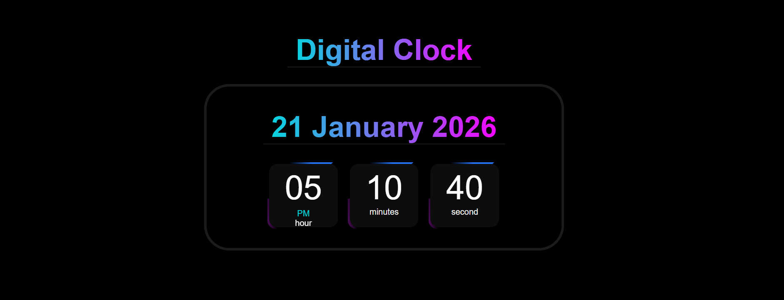

# ⏰ Digital Clock Project

A modern and responsive **Digital Clock** built using **HTML, CSS, and JavaScript**.  
This project displays the **current date**, **time in 12-hour format**, and **AM/PM** with a stylish animated UI.

---

## 📸 Preview

---

## ✨ Features
- 🕒 Real-time digital clock
- 📅 Displays current date (Day, Month, Year)
- ⏱ 12-hour time format with **AM/PM**
- 🎨 Modern gradient UI with animation
- 📱 Fully responsive design
- ⚡ Updates every second using JavaScript

---

## 🛠️ Technologies Used
- **HTML5**
- **CSS3**
- **JavaScript (ES6)**
